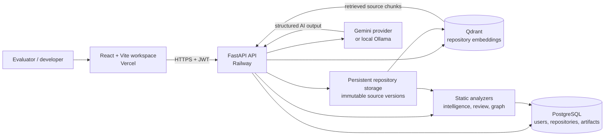

# CodePilot AI

[](https://codepilot-ai-hackathon.vercel.app)
[](https://api-production-f51d.up.railway.app/api/v1/health)
[](LICENSE)

**CodePilot AI** turns an unfamiliar source repository into a private, searchable engineering workspace. It imports a GitHub repository or ZIP file, maps the implementation, finds code-quality issues, generates architecture and documentation artifacts, and gives grounded AI assistance with file-and-line citations.

**Live application:** [codepilot-ai-hackathon.vercel.app](https://codepilot-ai-hackathon.vercel.app)

**Source repository:** [Sumitkate55/CodePilot-AI](https://github.com/Sumitkate55/CodePilot-AI)
**Backend status:** [API health check](https://api-production-f51d.up.railway.app/api/v1/health)

> **For evaluators:** create a throwaway account and use a public repository only. The hosted app may take a short moment to wake up on the free hosting tier. AI actions use the Gemini free tier; run one generation at a time and wait briefly between requests if the provider reports a quota cooldown.

## What you can evaluate in five minutes

1. Open the [live application](https://codepilot-ai-hackathon.vercel.app) and create an account.
2. Import a public GitHub repository, or use `https://github.com/Sumitkate55/CodePilot-AI.git` as a sample.
3. Select **Analyze repository** to see languages, frameworks, dependencies, symbols, service/database clues, environment files, Docker artifacts, and statistics.
4. Use the sticky **Jump to** bar in the repository workspace to open the architecture graph, review findings, documentation, test generator, and repository history without excessive scrolling.
5. Select **Index repository** and ask a repository question. The response is constrained to retrieved source chunks and includes file-and-line citations.
6. Try an AI action such as **Generate summary**, **Explain code**, **Generate refactor**, or **Generate test file**. Results are saved against the immutable imported repository version.

## Feature map

| Capability | What it does | Key result |
| --- | --- | --- |
| Secure workspace | Registers users, signs them in, refreshes JWT sessions, and scopes all records to their owner | Private repository workspace per account |
| Repository intake | Imports public GitHub URLs or ZIP uploads, clones/extracts safely, records immutable versions, and supports deletion/history | Reproducible repository snapshots |
| Repository intelligence | Detects languages, frameworks, dependencies, folder layout, environment/Docker/database clues, classes, functions, and services | A structured codebase profile and statistics |
| AI project summary | Produces an overview plus architecture, feature, frontend, backend, database, authentication, and API flows | Saved, evidence-based project brief |
| Repository chat (RAG) | Chunks safe source files, stores embeddings in Qdrant, retrieves relevant code, and validates citations | Grounded answers with file/line references |
| Architecture graph | Builds an interactive React Flow graph of frontend, backend, services, data, and dependencies | Zoomable, pannable system map with source navigation |
| Explain code | Lets a reviewer select a discovered function and obtain purpose, inputs, outputs, dependencies, and logic | Focused code comprehension artifact |
| Code review | Runs repository-wide deterministic checks for security, performance, dead code, code smells, duplication, naming, and long functions | Filterable findings with severity, confidence, and recommendations |
| Refactoring advisor | Turns review findings into a prioritized proposal with confidence, impact, highlighted source, generated diff, and accept/reject state | Actionable refactoring workflow without overwriting source |
| Test generator | Selects detected functions and creates pytest, Jest, or JUnit tests covering happy, edge, invalid, and boundary cases | Saved test-file artifacts |
| Documentation generator | Creates README, API, folder, installation, and usage documentation from repository intelligence | Repository-specific Markdown documentation |
| Dashboard and history | Aggregates repository scores, statistics, quick actions, timelines, and version history | At-a-glance engineering workspace |

## System architecture



The frontend never receives database, JWT-signing, Qdrant, or AI-provider credentials. The API is the only component that can access source storage, provider secrets, PostgreSQL, and Qdrant.

## Project structure

The backend follows Clean Architecture: domain rules do not depend on FastAPI, SQLAlchemy, Gemini, Qdrant, or filesystem implementations.

```text
CodePilot-AI/
├── apps/
│   ├── api/                              # FastAPI backend
│   │   ├── src/codepilot_api/
│   │   │   ├── domain/                   # Entities and repository contracts
│   │   │   ├── application/              # Use cases and orchestration
│   │   │   ├── infrastructure/           # SQLAlchemy, Git/ZIP, Qdrant, AI adapters
│   │   │   ├── presentation/             # HTTP routes, schemas, dependencies
│   │   │   ├── config/                   # Settings, security, logging
│   │   │   └── main.py                   # FastAPI application factory
│   │   ├── alembic/                      # PostgreSQL migrations
│   │   ├── tests/                        # Backend/unit/API regression tests
│   │   ├── Dockerfile
│   │   └── pyproject.toml
│   └── web/                              # React + Vite frontend
│       ├── src/
│       │   ├── app/                      # Application shell and configuration
│       │   ├── components/               # Shared UI primitives/layouts
│       │   ├── features/repositories/    # Workspace panels and API queries
│       │   ├── pages/                    # Route-level screens
│       │   ├── providers/                # Query, theme, and auth providers
│       │   ├── routes/                   # Router and protected routes
│       │   ├── services/                 # Axios API client
│       │   └── stores/                   # Zustand client state
│       ├── Dockerfile
│       └── package.json
├── docker-compose.yml                    # Local full-stack environment
├── Dockerfile.railway                    # Production API image
├── railway.toml                          # Railway service configuration
├── DEPLOYMENT.md                         # Hosted deployment and security details
├── DEVPOST_SUBMISSION.md                 # Hackathon submission copy/checklist
├── DEMO_VIDEO_SCRIPT.md                  # <3-minute demo recording plan
├── LICENSE                               # MIT license
└── README.md
```

## Privacy, ownership, and safety

- Every repository, source version, artifact, and API request is owner-scoped. Knowing a repository ID does not grant access.
- The indexer excludes `.env`, credential-like files, binary files, and unsafe paths **before** sending text for embeddings or generation.
- Repository chat is retrieval-first: it answers only from selected source chunks and presents traceable file-and-line citations. If it cannot find enough context, it should say so rather than inventing an answer.
- Imported versions are stored as snapshots. Generated summaries, reviews, documentation, tests, and refactor proposals do not silently modify the original repository.
- Production secrets—including `JWT_SECRET_KEY`, database URLs, Qdrant URLs, and `GEMINI_API_KEY`—are server-side environment variables. They are never placed in `VITE_*` frontend variables or committed to Git.
- The production database and Qdrant service use private Railway networking. The public surface is the FastAPI API plus the Vercel frontend.

For the live demo, use public/open-source repositories only. Do not upload confidential code to a free-tier AI provider without reviewing that provider's data terms.

## Run locally

### Prerequisites

- Docker Desktop
- Git
- Optional: [Ollama](https://ollama.com/download) for fully local, no-paid-API AI features

### Start the complete stack

From the repository root:

```bash
docker compose up --build
```

Then open:

- Frontend: <http://localhost:5173>
- API documentation: <http://localhost:8000/docs>
- API health: <http://localhost:8000/api/v1/health>

Create an account, import a public GitHub repository or ZIP file, and select **Analyze repository**.

### Enable local AI with Ollama

In another terminal, run once:

```bash
ollama pull qwen2.5-coder:3b
ollama pull nomic-embed-text
ollama serve
```

Keep `ollama serve` running while the Docker API is running. The API connects to Ollama on the host so project summaries, RAG chat, explanation, refactoring, tests, and documentation can run locally without OpenAI credits.

If Ollama is unavailable, the authentication, import, intelligence, architecture graph, dashboard, history, and deterministic code review features still work. AI panels provide a useful provider error rather than returning invented output.

### Stop the stack

Press `Control + C` in the Docker terminal, then run:

```bash
docker compose down
```

This preserves PostgreSQL, Qdrant, and repository data in Docker volumes. The following command deliberately removes all local demo data and volumes:

```bash
docker compose down -v
```

## Hosted deployment

The public frontend is deployed on Vercel. The FastAPI API runs on Railway alongside private PostgreSQL, Qdrant, and persistent repository storage. The hosted API uses Gemini with its key stored only in Railway's backend variables.

Read [DEPLOYMENT.md](DEPLOYMENT.md) for production variables, the deployment topology, health checks, and verification steps. Read [DEVPOST_SUBMISSION.md](DEVPOST_SUBMISSION.md) for the intended hackathon category, description, and final submission checklist.

## Development checks

Backend:

```bash
cd apps/api
source .venv/bin/activate
PYTHONPATH=src ruff check src tests
PYTHONPATH=src python -m pytest
```

Frontend:

```bash
cd apps/web
npm run lint
npm run test
npm run build
```

## Built with Codex and GPT-5.6

CodePilot AI was built in iterative, test-backed phases with Codex using GPT-5.6. Codex accelerated the work by first analyzing the existing codebase, retaining its Clean Architecture boundaries, implementing the FastAPI/React features, designing the provider abstraction, adding deployment assets, and running lint, migration, test, Docker-build, and frontend-build checks.

Key engineering decisions were to:

- keep deterministic repository intelligence and static code review independent from AI availability;
- use Qdrant retrieval and citation validation to ground repository chat;
- remove secret-like files before indexing;
- save generated artifacts against immutable repository versions; and
- keep every provider credential on the server, behind a replaceable Gemini/Ollama adapter.

The normal hosted runtime uses Gemini. Local development can use Ollama. This separation makes the system demonstrable even when a hosted model's free-tier quota is temporarily unavailable.

## Supporting submission material

- [Demo video script](DEMO_VIDEO_SCRIPT.md)
- [Devpost submission checklist and project description](DEVPOST_SUBMISSION.md)
- [Deployment guide](DEPLOYMENT.md)
- [MIT License](LICENSE)
